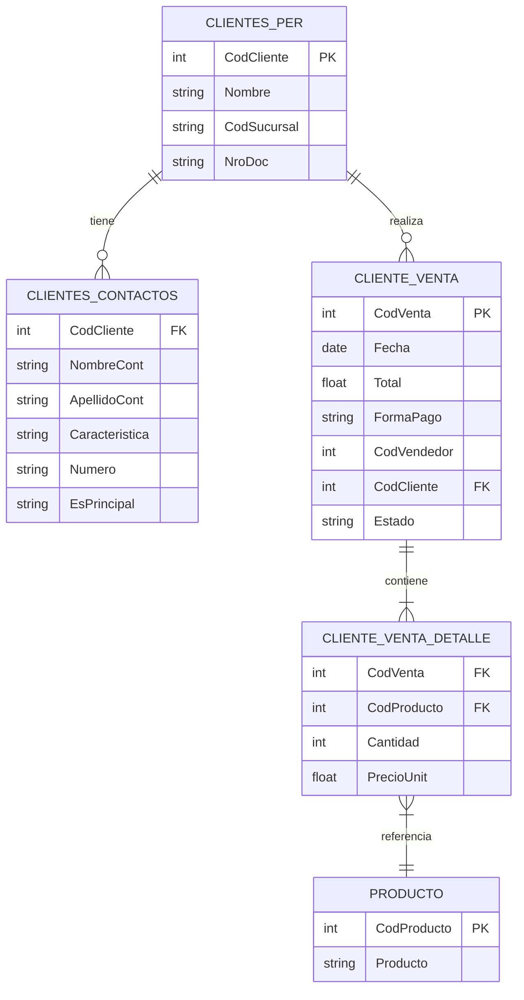
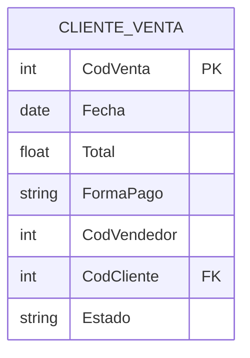
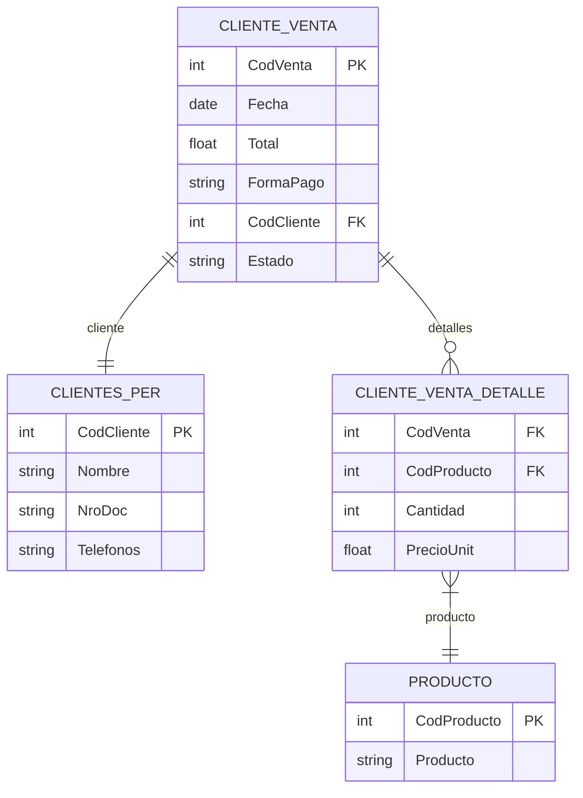

# Documentación de Clientes y Ventas

Este documento explica de manera sencilla cómo se relacionan las tablas principales utilizadas en el servicio `ClientesVentasService` y cómo funciona el flujo de una venta.

## Diagrama de relaciones (ER) general



---

# Endpoints principales

## 1. findAll

Devuelve todas las ventas registradas.

**Tablas involucradas:**
- CLIENTE_VENTA



**Ejemplo de respuesta:**
```json
[
  {
    "CodVenta": 1,
    "Fecha": "2024-05-01T00:00:00.000Z",
    "Total": 1000,
    "FormaPago": "Efectivo",
    "CodVendedor": 2,
    "CodCliente": 5,
    "Estado": "Finalizada"
  },
  ...
]
```

---

## 2. findByFecha

Devuelve todas las ventas entre dos fechas.

**Tablas involucradas:**
- CLIENTE_VENTA


**Ejemplo de respuesta:**
```json
[
  {
    "CodVenta": 2,
    "Fecha": "2024-05-02T00:00:00.000Z",
    "Total": 1500,
    "FormaPago": "Tarjeta",
    "CodVendedor": 3,
    "CodCliente": 7,
    "Estado": "Finalizada"
  },
  ...
]
```

---

## findByFechaConCliente

Devuelve ventas entre dos fechas, incluyendo datos del cliente y su contacto principal.

**Endpoint:**
```
GET /api/clientes-ventas/filtro/fecha?desde=YYYY-MM-DD&hasta=YYYY-MM-DD
```

**Ejemplo de respuesta real:**
```json
[
  {
    "venta_CodVenta": "01036653",
    "venta_CodCliente": "0105173",
    "venta_Fecha": "2025-06-25T03:00:00.000Z",
    "venta_Total": 444000,
    "venta_FormaPago": "MUL ",
    "venta_CodVendedor": 2,
    "Nombre": "ANTONIO RAMÓN",
    "CodSucursal": 1,
    "NroDoc": 28624608,
    "NombreCont": "ANTONO RAMON",
    "ApellidoCont": "LOPES",
    "Telefonos": "3718467074"
  }
]
```

**Significado de los campos:**
- `venta_CodVenta`: Código de la venta
- `venta_CodCliente`: Código del cliente
- `venta_Fecha`: Fecha de la venta (ISO 8601)
- `venta_Total`: Importe total de la venta
- `venta_FormaPago`: Forma de pago (puede venir con espacios)
- `venta_CodVendedor`: Código del vendedor
- `Nombre`: Nombre del cliente (tabla principal)
- `CodSucursal`: Código de la sucursal del cliente
- `NroDoc`: Número de documento del cliente
- `NombreCont`: **Nombre del contacto principal del cliente** (es el que se muestra en el frontend como "Nombre Cliente")
- `ApellidoCont`: **Apellido del contacto principal del cliente** (es el que se muestra en el frontend como "Nombre Cliente")
- `Telefonos`: Teléfono principal del contacto

**¿De dónde se obtiene el nombre que se muestra en el frontend?**
- El nombre y apellido que ves en la columna "Nombre Cliente" del frontend corresponden a los campos `NombreCont` y `ApellidoCont`.
- Estos datos provienen de la tabla `Clientes_Contactos`.
- En la consulta del backend, se realiza un **JOIN** entre la tabla de ventas y la tabla de contactos (`Clientes_Contactos`), seleccionando el contacto principal (`EsPrincipal = 'S'`) para cada cliente.
- Por eso, el nombre mostrado puede diferir del nombre registrado en la tabla principal de clientes (`Clientes_Per`).
- **El teléfono mostrado en la columna "Teléfonos" también se obtiene de esta tabla, combinando los campos `Caracteristica` y `Numero` del contacto principal.**

**Ejemplo:**
```json
{
  "NombreCont": "SERGIO",
  "ApellidoCont": "BENITEZ ",
  "Caracteristica": "3718",
  "Numero": 505938
}
```
Esto es lo que se muestra como "Nombre Cliente" y "Teléfonos" en la tabla del frontend (por ejemplo, el teléfono sería `3718505938`).

**Notas:**
- El nombre y apellido pueden diferir entre el cliente y el contacto principal.
- El campo `Telefonos` puede venir solo con números, sin formato.
- La forma de pago puede venir con espacios, se recomienda hacer trim en el frontend si se muestra.

---

## 4. findVentaCompleta

Devuelve todos los datos de una venta, incluyendo cliente, detalles y productos.

**Tablas involucradas:**
- CLIENTE_VENTA
- CLIENTES_PER
- CLIENTE_VENTA_DETALLE
- PRODUCTO



**Ejemplo de respuesta:**
```json
{
  "CodVenta": 4,
  "Fecha": "2024-05-04T00:00:00.000Z",
  "Total": 3000,
  "FormaPago": "Efectivo",
  "Estado": "Finalizada",
  "cliente": {
    "codCliente": 10,
    "nombre": "María",
    "nroDoc": "87654321",
    "telefonos": "+541198765432"
  },
  "detalles": [
    {
      "CodProducto": 101,
      "NombreProducto": "Silla",
      "Cantidad": 2,
      "PrecioUnit": 500,
      "Subtotal": 1000
    },
    {
      "CodProducto": 102,
      "NombreProducto": "Mesa",
      "Cantidad": 1,
      "PrecioUnit": 2000,
      "Subtotal": 2000
    }
  ]
}
```

---

# Flujo de consumo: del frontend al backend

A continuación se explica, en forma de flujo, cómo las acciones del usuario en la vista disparan llamadas a los endpoints del backend y cómo estos endpoints utilizan las funciones del servicio en el backend.

## 1. Al iniciar la vista de ventas
- **Acción:** Se carga la vista `VentasWsView.vue`.
- **Qué ocurre:**
  - Automáticamente se solicita el listado de ventas del día actual (o del rango por defecto).
  - Se llama al endpoint:
    - **GET** `/api/clientes-ventas/filtro/fecha?desde=...&hasta=...`
  - **Backend:** Este endpoint ejecuta la función `findByFechaConCliente(desde, hasta)` del servicio `ClientesVentasService`.
  - **Resultado:** Se obtiene la lista de ventas con datos de cliente y contacto principal, que se muestra en la tabla.

## 2. Cuando el usuario cambia el rango de fechas
- **Acción:** El usuario selecciona un nuevo rango de fechas en el filtro de la vista.
- **Qué ocurre:**
  - Se vuelve a llamar al endpoint:
    - **GET** `/api/clientes-ventas/filtro/fecha?desde=...&hasta=...`
  - **Backend:** Se ejecuta nuevamente `findByFechaConCliente(desde, hasta)`.
  - **Resultado:** Se actualiza la tabla con las ventas del nuevo rango.

## 3. Cuando el usuario hace clic en una venta para ver el detalle
- **Acción:** El usuario selecciona una venta en la tabla.
- **Qué ocurre:**
  - Se llama al endpoint:
    - **GET** `/api/clientes-ventas/:codVenta`
  - **Backend:** Este endpoint ejecuta la función `findVentaCompleta(codVenta)` del servicio.
  - **Resultado:** Se muestra el detalle completo de la venta, incluyendo cliente, productos y totales.

## 4. Cuando se filtra por sucursal o teléfono
- **Acción:** El usuario utiliza los filtros de sucursal o teléfono en la vista.
- **Qué ocurre:**
  - El filtrado se realiza en el frontend, sobre los datos ya obtenidos del endpoint de ventas por fecha.
  - **No se realiza una nueva llamada al backend** para estos filtros.

---

> **Resumen:**
> - La vista principal de ventas consume principalmente el endpoint `/api/clientes-ventas/filtro/fecha` (función `findByFechaConCliente`).
> - El detalle de una venta se obtiene con `/api/clientes-ventas/:codVenta` (función `findVentaCompleta`).
> - Los filtros de sucursal y teléfono se aplican en el frontend, no en el backend.

De esta forma, cada acción del usuario en la interfaz tiene un flujo claro hacia el backend y sus funciones correspondientes.

---
